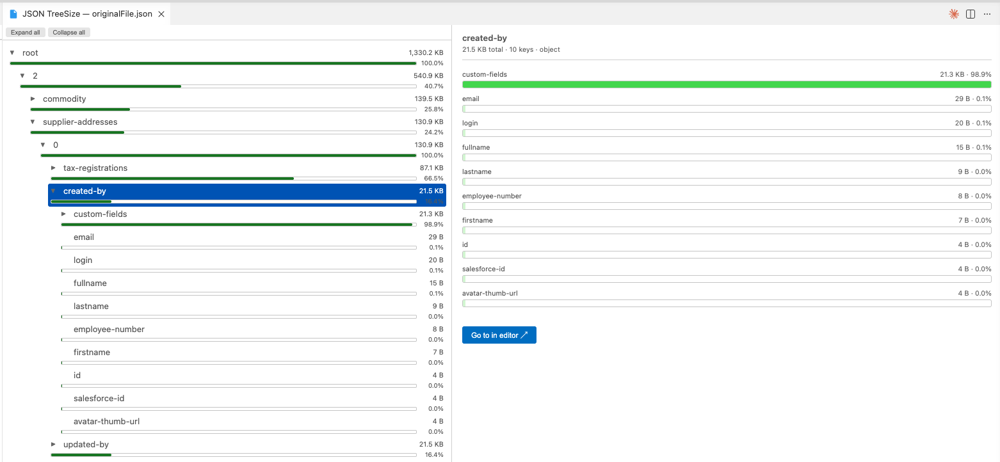

# JSON TreeSize

[](https://marketplace.visualstudio.com/items?itemName=AlvaroEnriqueRuano.json-treesize)
[](https://marketplace.visualstudio.com/items?itemName=AlvaroEnriqueRuano.json-treesize)
[](https://marketplace.visualstudio.com/items?itemName=AlvaroEnriqueRuano.json-treesize)
[](https://github.com/aruanoguate/json-treesize/actions/workflows/sonarcloud.yml)
[](https://sonarcloud.io/summary/new_code?id=aruanoguate_json-treesize)
[](https://sonarcloud.io/summary/new_code?id=aruanoguate_json-treesize)

**Ever wondered what's bloating that 50 MB JSON file?**

JSON TreeSize gives you the same "what's eating my disk?" experience as [TreeSize](https://www.jam-software.com/treesize) or [WinDirStat](https://windirstat.net/) — but for JSON files, right inside VS Code. No CLI tools, no pasting into online formatters, no leaving your editor.

Built by a developer, for developers. Free, open-source, no telemetry. Just right-click a `.json` file and see where the bytes are.



## Why JSON TreeSize?

| Problem | Solution |
|---------|----------|
| "This config file is 12 MB and I have no idea why" | Instantly see which keys consume the most bytes |
| "I need to cut our API response payload" | Drill down the tree to find the heaviest nested objects |
| "Online JSON size tools feel sketchy for production data" | Everything runs locally in VS Code — your data never leaves your machine |
| "I found the big key — now I need to edit it" | Click **"Go to in editor"** to jump straight to that line in the source |

## Features

- **Interactive tree explorer** — expandable nodes showing byte size and percentage of parent
- **Detail bar chart** — click any node to see its children ranked by size with percentage bars
- **HSL heat-map coloring** — larger nodes get vivid colors, smaller nodes fade to background
- **Theme-aware** — color scale adjusts automatically for dark, light, and high-contrast themes
- **Configurable base color** — pick any hex color from the Settings UI color picker
- **Expand / Collapse all** — toolbar buttons in the tree pane
- **Left↔right sync** — clicking a bar in the detail pane highlights the tree node
- **Go to in editor** — one-click navigation from any node to its position in the raw JSON
- **Worker thread parsing** — files up to 50 MB+ parsed without blocking the editor UI

## Getting Started

### Install

Search for **"JSON TreeSize"** in the VS Code Extensions view (`Ctrl+Shift+X` / `Cmd+Shift+X`), or install from the [Marketplace](https://marketplace.visualstudio.com/items?itemName=AlvaroEnriqueRuano.json-treesize).

### Use

1. Right-click any `.json` file in the Explorer sidebar → **"Analyze with JSON TreeSize"**
2. Or open the Command Palette (`Ctrl+Shift+P` / `Cmd+Shift+P`) → **"JSON TreeSize: Analyze"**

## Settings

| Setting | Default | Description |
|---------|---------|-------------|
| `jsonTreeSize.baseColor` | `"#4a9eda"` | Base color for the size heat map. Opens a native color picker in Settings. Leave empty for the default blue. |

## Contributing

Contributions are welcome! This is an open-source project maintained by a solo developer.

```bash
git clone https://github.com/aruanoguate/json-treesize.git
cd json-treesize
npm install
npm run compile
# Press F5 in VS Code to launch the Extension Development Host
npm test           # 83 tests, 100% coverage
```

See the [project structure](#project-structure) below for orientation.

## Project Structure

```
src/
├── extension.ts        # Entry point — registers the command
├── panel.ts            # Webview panel lifecycle, worker spawning, message bridge
├── types.ts            # Shared TypeScript types (SizeNode, message protocol)
├── utils.ts            # Pure helpers (hex color validation)
├── worker/
│   └── parser.ts       # Worker thread — JSON parsing and size tree computation
└── webview/
    ├── color.ts        # Color utilities: hexToHsl, heatColor, wcagTextColor
    ├── helpers.ts      # Extracted pure functions: formatSize, pct, escHtml
    ├── main.ts         # Webview renderer — tree + detail pane + toolbar
    └── styles.css      # Layout and styling
```

## License

[MIT](LICENSE) — free for personal and commercial use.

---

*Made with care by [Alvaro Enrique Ruano](https://github.com/aruanoguate). If you find this useful, a ⭐ on [GitHub](https://github.com/aruanoguate/json-treesize) is appreciated!*
